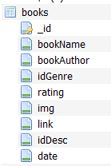

 

# Kitap App

Reading books in the Kazakh language in the Latin alphabet and learning the Latin alphabet. (Enables translation into Latin alphabet in Cyrillic text).

> Application development environment: __Android Studio__

> Work with the database: __SQLite__

> Create a project design: __Figma__

> The programming language used in the project is __Java__.
---
The database consists of 3 tables: _books, description, genres._

  

---
## Main page

 

The main page consists of three main parts.
* Most popular
* New
* Easy reading

Popular - books are displayed sorted by rating.

New is sorted by the date it was added to the database, and Easy Read is sorted by the number of pages.

There are 10 books in each section, and when you click the All button, a sorted list of 25 books will appear.
---
## Genres page

  

When you go to the category page, a list of book genres will appear, and when you select a desired genre, a list of books of that genre will appear.

---

## Search page

Here is how the search page for the required book works. Search by Author and Book name works at the same time.

---

## Single book page

Personal book page. Here is a little information about the book.
This page will check if the book is loaded. If the book is not downloaded, the button says Download. If loaded, it says Reading. Clicking the read button opens the book for reading in PDF format.

---

## Translator page

 

To translate text from Cyrillic to Latin and vice versa. (Letters) Symbols that may not be available on the phone are listed in a separate section.

